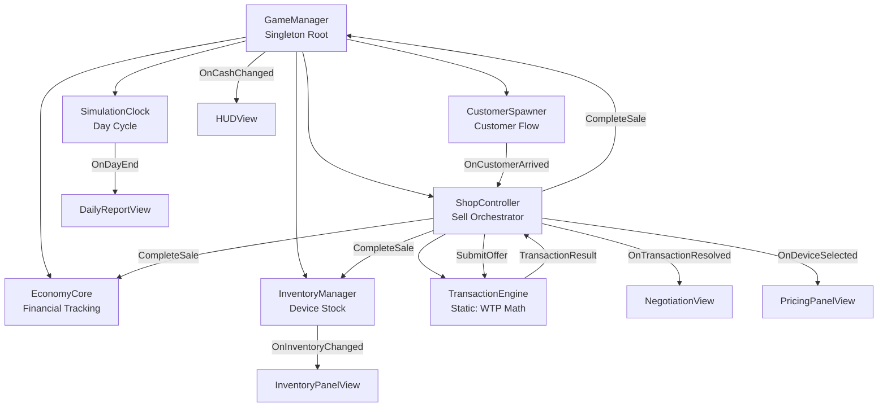
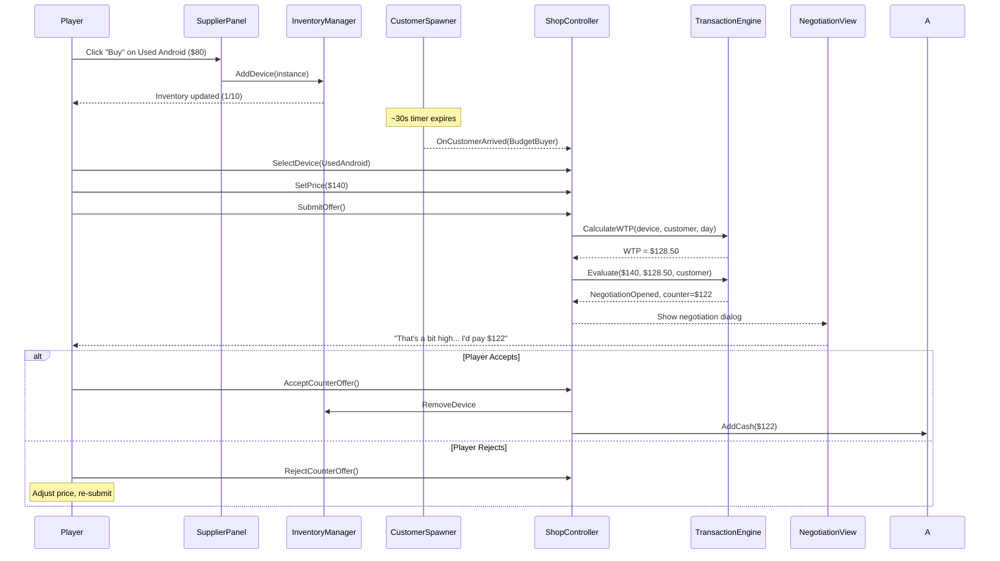

# Device Empire V1 — Complete Implementation Guide
## Core Sell Loop Prototype · Unity C#

---

## 📁 All Scripts Created — File Map

```
Assets/_Project/Scripts/
├── Core/
│   ├── GameManager.cs          ← Singleton root, global state, cash ops
│   ├── SimulationClock.cs      ← Day cycle, time events, daily stats
│   ├── ShopController.cs       ← Sell flow orchestrator (select → price → sell)
│   ├── TransactionEngine.cs    ← Static WTP/pricing formulas (THE core math)
│   └── GameBootstrapper.cs     ← Scene init, validates refs, starts Day 1
├── Economy/
│   └── EconomyCore.cs          ← Financial tracking, sale recording
├── Inventory/
│   ├── DeviceData.cs           ← ScriptableObject: device type definition
│   ├── DeviceInstance.cs        ← Runtime: single owned device with state
│   └── InventoryManager.cs     ← Stock management, add/remove/query
├── Customers/
│   ├── CustomerArchetypeData.cs ← ScriptableObject: customer type template
│   ├── CustomerInstance.cs      ← Runtime: single customer with traits
│   └── CustomerSpawner.cs       ← Timed customer spawning, weighted selection
└── UI/
    ├── HUDView.cs              ← Cash, day, time, inventory display
    ├── InventoryPanelView.cs    ← Device list with click-to-select
    ├── PricingPanelView.cs      ← Price slider, margin feedback, submit
    ├── NegotiationView.cs       ← Counter-offer dialog, accept/reject
    ├── DailyReportView.cs       ← End-of-day financial summary
    └── SupplierPanel.cs         ← Buy devices from hardcoded supplier
```

**Total: 16 scripts** — all production-grade with full XML documentation.

---

## 🏗️ Unity Scene Setup — Step by Step

### Step 1: Create the Scene Hierarchy

In your `Main.unity` scene, create this hierarchy:

```
[Scene Root]
├── Managers/                    ← Empty GameObject (organizer)
│   ├── GameManager              ← Add: GameManager.cs, GameBootstrapper.cs
│   ├── SimulationClock          ← Add: SimulationClock.cs
│   ├── EconomyCore              ← Add: EconomyCore.cs
│   ├── InventoryManager         ← Add: InventoryManager.cs
│   ├── CustomerSpawner          ← Add: CustomerSpawner.cs
│   └── ShopController           ← Add: ShopController.cs
├── Canvas/                      ← UI Canvas (Screen Space - Overlay)
│   ├── HUD                      ← Add: HUDView.cs
│   ├── InventoryPanel           ← Add: InventoryPanelView.cs
│   ├── PricingPanel             ← Add: PricingPanelView.cs
│   ├── NegotiationPanel         ← Add: NegotiationView.cs
│   ├── DailyReportPanel         ← Add: DailyReportView.cs
│   └── SupplierPanel            ← Add: SupplierPanel.cs
├── EventSystem                  ← Auto-created with Canvas
└── Main Camera
```

### Step 2: Wire Manager References

On the **GameManager** Inspector, drag-and-drop:

| Field | Drag From |
|-------|-----------|
| Clock | `Managers/SimulationClock` |
| Economy | `Managers/EconomyCore` |
| Inventory | `Managers/InventoryManager` |
| Customers | `Managers/CustomerSpawner` |
| Shop | `Managers/ShopController` |

> [!IMPORTANT]
> All 5 references must be assigned or the GameBootstrapper will log errors and refuse to start.

### Step 3: Import TextMeshPro

If not already imported:
1. Go to **Window → TextMeshPro → Import TMP Essential Resources**
2. Click Import All

---

## 📦 ScriptableObject Setup

### Create Device Data Assets

1. Right-click in `Assets/_Project/ScriptableObjects/Devices/`
2. Select **Create → DeviceEmpire → Device Data**
3. Create these 3 starter devices:

#### Phone_UsedAndroid.asset
| Field | Value |
|-------|-------|
| DeviceName | Used Android Phone |
| Category | Phone |
| BaseWholesalePrice | 80 |
| SuggestedRetailPrice | 140 |
| DepreciationPerDay | 0.5 |
| ConditionMultiplier_New | 1.0 |
| ConditionMultiplier_Good | 0.85 |
| ConditionMultiplier_Fair | 0.65 |
| ConditionMultiplier_Poor | 0.40 |

#### Phone_MidRange.asset
| Field | Value |
|-------|-------|
| DeviceName | Mid-Range Smartphone |
| Category | Phone |
| BaseWholesalePrice | 200 |
| SuggestedRetailPrice | 320 |
| DepreciationPerDay | 1.0 |
| ConditionMultiplier_New | 1.0 |
| ConditionMultiplier_Good | 0.85 |
| ConditionMultiplier_Fair | 0.65 |
| ConditionMultiplier_Poor | 0.40 |

#### Laptop_Budget.asset
| Field | Value |
|-------|-------|
| DeviceName | Budget Laptop |
| Category | Laptop |
| BaseWholesalePrice | 250 |
| SuggestedRetailPrice | 400 |
| DepreciationPerDay | 0.8 |
| ConditionMultiplier_New | 1.0 |
| ConditionMultiplier_Good | 0.85 |
| ConditionMultiplier_Fair | 0.65 |
| ConditionMultiplier_Poor | 0.40 |

### Create Customer Archetype Assets

1. Right-click in `Assets/_Project/ScriptableObjects/Customers/`
2. Select **Create → DeviceEmpire → Customer Archetype**

#### Archetype_BudgetBuyer.asset
| Field | Value |
|-------|-------|
| ArchetypeName | Budget Buyer |
| BudgetSensitivity | (0.7, 1.0) |
| TechSavviness | (0.0, 0.2) |
| Patience | (0.2, 0.5) |
| SocialInfluence | (0.1, 0.3) |
| PreferredCategories | Phone |
| BudgetRange | (50, 150) |
| SpawnWeight | 1.5 |

#### Archetype_StandardShopper.asset
| Field | Value |
|-------|-------|
| ArchetypeName | Standard Shopper |
| BudgetSensitivity | (0.4, 0.7) |
| TechSavviness | (0.2, 0.5) |
| Patience | (0.4, 0.7) |
| SocialInfluence | (0.2, 0.5) |
| PreferredCategories | Phone, Laptop |
| BudgetRange | (100, 350) |
| SpawnWeight | 1.0 |

### Assign ScriptableObjects to Managers

**CustomerSpawner Inspector:**
- Drag both archetype assets into the `Available Archetypes` array

**SupplierPanel Inspector:**
- Drag all 3 device assets into the `Available Devices` array

---

## 🎨 UI Prefab Setup

### Required UI Prefabs

You need to create 2 prefabs for dynamic lists:

#### 1. SupplierItem Prefab (`Assets/_Project/Prefabs/UI/SupplierItem.prefab`)

```
SupplierItem (Button component)
├── DeviceName     (TextMeshProUGUI)
├── Condition      (TextMeshProUGUI)
├── Price          (TextMeshProUGUI)
└── BuyButton      (Button + TextMeshProUGUI child "BUY")
```

> [!TIP]
> Layout: Use a **Horizontal Layout Group** on the root. Set each child's preferred width so they align in columns.

#### 2. InventoryItem Prefab (`Assets/_Project/Prefabs/UI/InventoryItem.prefab`)

```
InventoryItem (Button component for click selection)
├── Icon           (Image)
├── DeviceName     (TextMeshProUGUI)
├── Condition      (TextMeshProUGUI)
├── Cost           (TextMeshProUGUI)
├── Value          (TextMeshProUGUI)
└── Category       (TextMeshProUGUI)
```

> [!IMPORTANT]
> The child GameObjects MUST be named **exactly** as shown above — the scripts find them via `transform.Find("DeviceName")`.

### UI Panel Layouts

#### HUD Panel (always visible, top of screen)
```
HUD (Panel, anchor: top-stretch)
├── CashText            (TMP: "$500.00")
├── CashChangeText      (TMP: "+$50.00", starts hidden)
├── DayText             (TMP: "Day 1")
├── TimeText            (TMP: "9:00 AM")
├── DayProgressBar      (Slider, fill bar)
├── InventoryCountText  (TMP: "Inventory: 0/10")
├── CustomerStatusText  (TMP: "Waiting for customers...")
├── SupplierButton      (Button: "📦 Supplier")
├── PauseButton         (Button: "⏸ Pause")
├── SpeedButton         (Button: "1x")
└── EndDayButton        (Button: "End Day")
```

#### Pricing Panel (right side, shows when device selected)
```
PricingPanel (Panel, anchor: right)
├── NoDevicePanel/      (shown when nothing selected)
│   └── Text: "Select a device from inventory"
├── PricingContent/     (shown when device selected)
│   ├── DeviceName      (TMP)
│   ├── Condition       (TMP)
│   ├── Icon            (Image)
│   ├── PurchasePrice   (TMP: "You paid: $80.00")
│   ├── MarketValue     (TMP: "Market value: $78.50")
│   ├── PriceSlider     (Slider)
│   ├── PriceInputField (TMP InputField)
│   ├── CurrentPrice    (TMP: "$140.00")
│   ├── ProfitText      (TMP: "Profit: +$60.00")
│   ├── MarginText      (TMP: "Margin: 75.0%")
│   ├── AssessmentText  (TMP: "Fair Price")
│   ├── AssessmentIndicator (Image, color-coded)
│   ├── SubmitButton    (Button: "OFFER TO CUSTOMER")
│   └── DismissButton   (Button: "Dismiss Customer")
```

#### Negotiation Panel (center popup, shown during negotiation)
```
NegotiationPanel (Panel, center overlay, starts inactive)
├── CustomerName     (TMP)
├── CustomerType     (TMP)
├── CustomerVisual   (Image)
├── FeedbackText     (TMP — customer's spoken reaction)
├── YourPriceText    (TMP: "Your price: $140.00")
├── CounterOfferText (TMP: "Their offer: $125.00")
├── ProfitIfAccept   (TMP: "Profit if accepted: +$45.00")
├── PatienceText     (TMP: "Patience: 2 rounds left")
├── PatienceBar      (Slider)
├── AcceptButton     (Button: "Accept $125.00")
└── RejectButton     (Button: "Reject & Re-price")
```

#### Daily Report Panel (center popup, shown on day end)
```
DailyReportPanel (Panel, center overlay, starts inactive)
├── TitleText        (TMP: "Day 1 Report")
├── RevenueText      (TMP)
├── CostOfGoodsText  (TMP)
├── ProfitText       (TMP)
├── MarginText       (TMP)
├── UnitsSoldText    (TMP)
├── CustomersServed  (TMP)
├── CustomersLost    (TMP)
├── EndingCashText   (TMP)
├── InventoryValue   (TMP)
├── NetWorthText     (TMP)
├── PerformanceText  (TMP — emoji rating)
└── NextDayButton    (Button: "Start Day 2")
```

#### Supplier Panel (left side popup, toggled via HUD button)
```
SupplierPanel (Panel, anchor: left, starts inactive)
├── HeaderText       (TMP: "Street Supplier")
├── CashDisplay      (TMP: "Cash: $500.00")
├── SlotsDisplay     (TMP: "Inventory: 0/10")
├── ItemListContainer (Vertical Layout Group — items spawned here)
│   └── [SupplierItem prefabs spawned dynamically]
└── CloseButton      (Button: "✕")
```

---

## 🔌 Wiring Inspector References

After creating the UI, you need to drag references in each script's Inspector:

### HUDView Inspector
| Field | Drag From |
|-------|-----------|
| cashText | HUD/CashText |
| cashChangeText | HUD/CashChangeText |
| dayText | HUD/DayText |
| timeText | HUD/TimeText |
| dayProgressBar | HUD/DayProgressBar |
| inventoryCountText | HUD/InventoryCountText |
| customerStatusText | HUD/CustomerStatusText |
| supplierButton | HUD/SupplierButton |
| pauseButton | HUD/PauseButton |
| speedButton | HUD/SpeedButton |
| endDayButton | HUD/EndDayButton |
| supplierPanel | Canvas/SupplierPanel |

### SupplierPanel Inspector
| Field | Drag From |
|-------|-----------|
| availableDevices | All 3 DeviceData assets |
| itemListContainer | SupplierPanel/ItemListContainer |
| supplierItemPrefab | Prefabs/UI/SupplierItem |
| closeButton | SupplierPanel/CloseButton |
| headerText | SupplierPanel/HeaderText |
| cashDisplay | SupplierPanel/CashDisplay |
| slotsDisplay | SupplierPanel/SlotsDisplay |

### InventoryPanelView Inspector
| Field | Drag From |
|-------|-----------|
| itemListContainer | InventoryPanel/ItemListContainer |
| inventoryItemPrefab | Prefabs/UI/InventoryItem |
| emptyText | InventoryPanel/EmptyText |
| headerText | InventoryPanel/HeaderText |

*(Similar wiring for PricingPanelView, NegotiationView, DailyReportView — match field names to child GameObjects)*

---

## 🔄 System Architecture — Data Flow



---

## 🎮 Gameplay Flow



---

## ✅ V1 Testing Checklist

Test each item in order. Don't move to the next until the previous passes.

- [ ] **Scene loads without errors** — Console shows `[Bootstrapper] === INITIALIZATION COMPLETE ===`
- [ ] **Cash displays correctly** — HUD shows `$500.00`
- [ ] **Supplier panel opens/closes** — Click Supplier button, see device list
- [ ] **Can buy a device** — Cash decreases, device appears in inventory panel
- [ ] **Inventory full rejection** — Buy 10 devices, 11th shows error
- [ ] **Insufficient funds rejection** — Try to buy with not enough cash
- [ ] **Customer spawns after ~30 seconds** — Console logs customer arrival
- [ ] **Customer shows wanted category** — HUD shows "Budget Buyer wants: Phone"
- [ ] **Selecting device populates pricing panel** — Click device in inventory
- [ ] **Price slider changes displayed price** — Drag slider, see price/margin update
- [ ] **Assessment text changes with price** — Low price = green, high = red
- [ ] **Submit at fair price → negotiation** — Counter-offer dialog appears
- [ ] **Accept counter-offer → sale completes** — Cash increases, device removed
- [ ] **Reject counter-offer → can re-price** — Dialog closes, can adjust price
- [ ] **Massively overpriced → customer leaves** — Set price 3x market value
- [ ] **Heavily underpriced → immediate accept** — Set price below 85% of value
- [ ] **Dismiss customer button works** — Customer leaves, next spawns after delay
- [ ] **Day ends (8 min or "End Day" button)** — Daily report popup appears
- [ ] **Daily report shows correct numbers** — Revenue, profit, units match
- [ ] **"Start Next Day" button works** — Report closes, Day 2 begins
- [ ] **Pause/Resume works** — Time stops, customers don't spawn
- [ ] **Speed button cycles 1x → 2x → 3x** — Day progresses faster
- [ ] **Empty inventory + customer = no crash** — Game handles gracefully
- [ ] **Selling below cost shows negative margin** — Red text in pricing panel

---

## 🐛 Common Issues & Fixes

| Issue | Cause | Fix |
|-------|-------|-----|
| `NullReferenceException` on game start | Manager references not assigned in GameManager Inspector | Drag all 5 managers into their slots |
| No customers spawning | No archetypes in CustomerSpawner array | Drag archetype assets into the array |
| Supplier panel empty | No devices in SupplierPanel array OR missing prefab | Assign devices + create SupplierItem prefab |
| UI text not showing | Missing TextMeshPro import | Window → TMP → Import Essentials |
| Inventory items not clickable | Button component missing on prefab | Add Button component to InventoryItem root |
| Price slider not working | Not connected in PricingPanelView Inspector | Drag slider into the priceSlider field |
| Cash shows NaN | Division by zero in margin calculation | Fixed in code — PurchasePrice check added |

---

## 🔮 What's Next (V2 Preview)

V1 is complete when the checklist above passes. Before building V2, ask yourself:

> **"Does buying cheap and selling for profit feel satisfying?"**

If yes → proceed to V2. If not → polish V1 first.

**V2 adds:**
- Reputation system (customer satisfaction affects future traffic)
- Supplier tiers (street vendor → wholesaler → distributor)
- Device brand system (affects customer preference)
- Customer queue (multiple customers at once)
- Basic sound effects and UI animations
